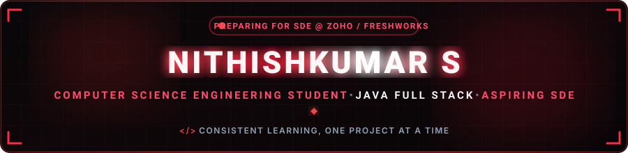
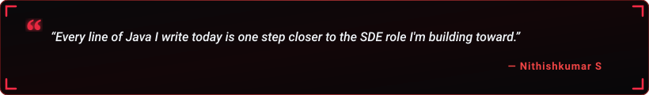

  

  

  
  &nbsp;
  
  &nbsp;
  
  &nbsp;
  

  

---

<h2 align="center">🔴 About Me</h2>

  

  

  Hey! I'm <b>Nithishkumar S</b>, a <b>B.E. Computer Science Engineering student</b> at Dhirajlal Gandhi College of Technology (DGCT), Salem, Tamil Nadu (Batch 2024–2028). 
  I'm working toward an SDE role at a product-based company like <b>Zoho</b> or <b>Freshworks</b> by 2028, with Java Full Stack development as my primary path.

  
  &nbsp;
  
  &nbsp;
  

  💬 <b>Let's Discuss:</b> Java, DSA, Spring Boot, Full Stack Development & System Design. 
  ⚡ <b>Philosophy:</b> <i>"Consistent, structured learning beats last-minute scrambling — every single time."</i>

<table width="100%" border="0" align="center">
<tr>
<td width="50%" align="center" style="padding: 14px;">
  <h4>🔭 Core Project</h4>
  
<a href="https://github.com/NITHISHKUMAR006/java-core-journey" target="_blank"><b>java-core-journey</b></a> Structured Java Learning Repository

</td>
<td width="50%" align="center" style="padding: 14px;">
  <h4>🌱 Active Deep Dives</h4>
  
<b>DSA (Striver's A2Z Sheet)</b> Java Full Stack & System Design

</td>
</tr>
<tr>
<td width="50%" align="center" style="padding: 14px;">
  <h4>🏆 SIH 2026</h4>
  
<b>StatWise AI</b> Problem Statement SIH26101

</td>
<td width="50%" align="center" style="padding: 14px;">
  <h4>🤝 Community</h4>
  
<b>DGCT Start-Up Club (C-I&E)</b> Member

</td>
</tr>
</table>

---

<h2 align="center">🔴 Featured Project Spotlight</h2>

<table width="100%" border="0" align="center">
<tr>
<td align="center" style="padding: 22px;">
  <h3>☕ Java Core Journey</h3>
  
<i>A structured Java learning repository covering 33 working files across core Java, OOP, Collections, Java 8 features, and a Calculator mini-project — built as part of my SDE preparation.</i>

   
  

    
    &nbsp;&nbsp;
    
  

</td>
</tr>
</table>

---

<h2 align="center">🧩 LeetCode Problem Solving</h2>

<i>Practicing DSA via Striver's A2Z Sheet — easy problems → pattern-based learning → company-specific prep.</i>

  

  

---

<h2 align="center">🛠️ Tech Stack & Skills</h2>

<b>Core Programming Languages</b>

  

<b>Full Stack & Frontend</b>

  

<b>Backend, Databases & Tools</b>

  

---

<h2 align="center">📊 GitHub Analytics & Activity</h2>

  
  &nbsp;&nbsp;
  

  

  

---

<h2 align="center">⚡ Contribution Journey</h2>

  

---

<h2 align="center">📬 Let's Connect &amp; Collaborate</h2>

<i>Whether it's Java, DSA, full stack projects, or SIH-style problem solving — my inbox is always open!</i>

<table border="0" align="center">
<tr>
<td align="center" width="220" style="padding: 16px;">
  <a href="https://linkedin.com/in/nithishkumarkps" target="_blank">
    
      
    
  </a>
   
  <b>Professional Network</b>
</td>
<td align="center" width="220" style="padding: 16px;">
  <a href="https://github.com/NITHISHKUMAR006" target="_blank">
    
      
    
  </a>
   
  <b>Projects &amp; Code</b>
</td>
<td align="center" width="220" style="padding: 16px;">
  <a href="mailto:YOUR_EMAIL@gmail.com">
    
      
    
  </a>
   
  <b>Direct Collaboration</b>
</td>
</tr>
</table>

  

